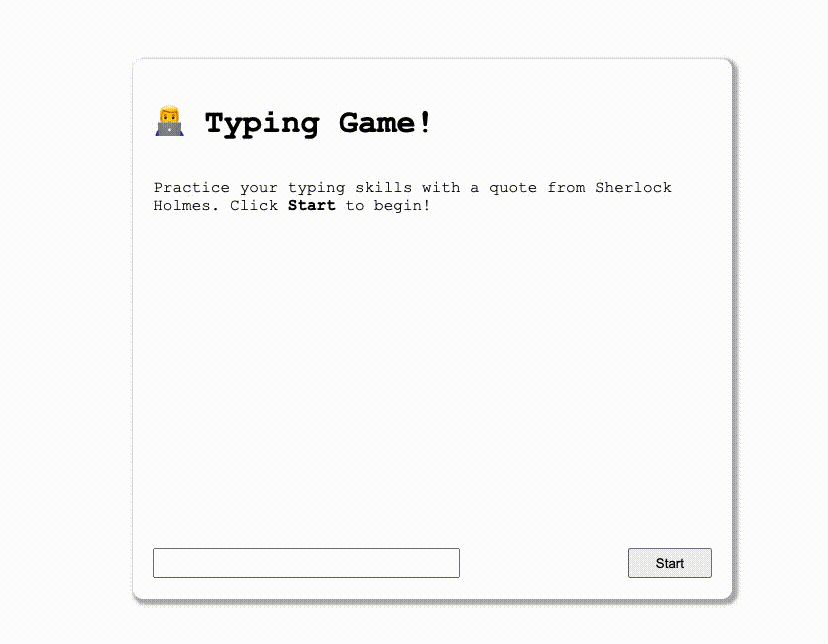

# practice-web-dev-for-beginners

[microsoft/Web-Dev-For-Beginners](https://github.com/microsoft/Web-Dev-For-Beginners) 실습 프로젝트 모음

## 3. Terrarium

[demo link](https://daehungwak.github.io/practice-web-dev-for-beginners/3-terrarium/)

- 기본적인 html, css 경험 -> flexbox, grid 로 ui 개선
- js dom event 등록 & closure를 활용하여 image 요소 이동 구현

## 4. Typing Game

[demo link](https://daehungwak.github.io/practice-web-dev-for-beginners/4-typing-game/)

